# VAR HR — تقرير التدقيق الأولي

**تاريخ التدقيق:** 2 سبتمبر 2026  
**النطاق:** جرد البنية، فحص الإعدادات، محاولة التشغيل، التحقق من البناء
والاختبارات، وتوثيق الفجوات. لم يتضمن هذا العمل إضافة ميزات HR جديدة أو
تغيير مخطط البيانات.

## 1. ملخص تنفيذي

المشروع تطبيق HR متعدد المستأجرين مبني على pnpm workspace، وليس مشروعًا
فارغًا أو prototype بسيطًا. توجد واجهة React/Vite، API كبير بعقد OpenAPI،
اتصال PostgreSQL/Drizzle، مصادقة بجلسات قاعدة البيانات، وعشرات قواعد العمل
للحضور والإجازات والرواتب والأجهزة.

التشغيل على Replit **نجح** بعد تثبيت الاعتماديات وتهيئة قاعدة البيانات وتشغيل
الـworkflows المُدارة. توجد ملاحظتان تشغيليتان:

1. `pnpm run build` من الجذر دون متغيرات workflow يفشل لأن إعدادات Vite تتطلب
   `PORT` و`BASE_PATH`. build كل artifact ينجح عند تمرير القيم الصحيحة.
2. الاختبارات تمر في 51 من 52 اختبارًا. الاختبار الوحيد الفاشل يطابق نصًا
   داخليًا في `App.tsx` بنمط لم يعد موجودًا حرفيًا؛ هذا مؤشر على اختبار هش،
   وليس دليلًا كافيًا على فشل سلوك API.

## 2. جرد البنية

### Workspace packages

يوجد 9 مشاريع workspace:

| المشروع | الدور | scripts المهمة |
| --- | --- | --- |
| root `workspace` | تنسيق المشروع | `typecheck`, `build` |
| `@workspace/var-hr` | الواجهة الرئيسية | `dev`, `build`, `typecheck` |
| `@workspace/api-server` | Express API | `dev`, `build`, `start`, `test`, `typecheck` |
| `@workspace/mockup-sandbox` | معاينة التصميم | `dev`, `build`, `typecheck` |
| `@workspace/db` | Drizzle/PostgreSQL | `push`, `push-force` |
| `@workspace/api-spec` | OpenAPI/Orval | `codegen` |
| `@workspace/api-client-react` | client مولد | package library |
| `@workspace/api-zod` | schemas مولدة | package library |
| `@workspace/scripts` | أدوات مساعدة | `hello`, `typecheck` |

الاعتماديات الرئيسية تشمل React 19، Vite 7، TypeScript 5.9، Express 5،
Drizzle ORM 0.45، Zod 4، React Query 5، Orval 8، Pino 9، وRadix UI.
الإصدارات الدقيقة موجودة في `package.json` و`pnpm-lock.yaml`.

### نقاط الدخول

- Frontend: `artifacts/var-hr/src/main.tsx` ثم `App.tsx`.
- API: `artifacts/api-server/src/index.ts` ثم `src/app.ts`.
- Routes: `artifacts/api-server/src/routes/index.ts`.
- Database: `lib/db/src/index.ts`.
- OpenAPI: `lib/api-spec/openapi.yaml`.
- Codegen: `lib/api-spec/orval.config.ts`.
- Vite: `artifacts/var-hr/vite.config.ts` و`artifacts/mockup-sandbox/vite.config.ts`.

## 3. فحص الإعداد والتشغيل

| الفحص | النتيجة | التفاصيل |
| --- | --- | --- |
| `pnpm install --frozen-lockfile` | ناجح | تم تثبيت 473 package من lockfile |
| `pnpm run typecheck` | ناجح | مكتبات وAPI وواجهات وسكربتات |
| API build | ناجح | esbuild bundle بحجم يقارب 2.9 MB |
| Frontend build | ناجح | بعد `PORT=22077 BASE_PATH=/` |
| Mockup build | ناجح | بعد `PORT=8081 BASE_PATH=/__mockup` |
| Database schema push | ناجح | `drizzle-kit push` طبّق التغييرات |
| API workflow | يعمل | يستمع على 8080 |
| Web workflow | يعمل | يستمع على 22077 |
| Mockup workflow | يعمل | يستمع على 8081 |
| Screenshot | ناجح | شاشة تسجيل الدخول ظهرت كما هو متوقع |
| API tests | 51/52 | اختبار واحد هش يفشل، موضح أدناه |

ظهر في أول محاولة تشغيل `EADDRINUSE` على 8080 و22077 و8081 بسبب عمليات
قديمة بقيت تستمع للمنافذ أثناء تبديل workflows. تم التحقق من العمليات
وإيقاف عمليات VAR HR المؤكدة فقط ثم إعادة تشغيل الخدمات المُدارة. لا يوجد
خطأ قاعدة بيانات في السجلات؛ تهيئة المخطط انتهت برسالة `Changes applied`.

### الاختبار الفاشل

الاختبار:

```text
attendance rule change history is restricted to company owners
```

في `artifacts/api-server/tests/attendance-rules-leave-balance.test.mjs`،
ويتوقع regex يطابق الاستدعاء النصي:

```text
useListAttendanceRuleChanges({ query: { enabled: canViewRuleHistory }
```

لكن `App.tsx` الحالي يستخدم نفس hook مع خيارات إضافية/تنسيق مختلف. باقي 51
اختبارًا نجح. الإصلاح المقترح هو اختبار سلوك الصلاحية أو تحديث matcher ليكون
مقاومًا للتنسيق، بدل ربطه بتمثيل النص الكامل للواجهة.

### ملاحظة المتصفح

تظهر شاشة تسجيل الدخول دون أخطاء rendering. يسجل المتصفح `401` لطلب حالة
المصادقة قبل تسجيل الدخول؛ هذا متوقع لأن endpoint محمي ويثبت أن الواجهة
تتعامل مع جلسة غير موجودة، وليس عطلًا في تحميل الصفحة.

## 4. الحالة الحالية حسب متطلبات HR

| المتطلب | الحالة الحالية | الدليل |
| --- | --- | --- |
| Employee CRUD | موجود | routes وhooks للموظفين مع استيراد وHR record |
| Payroll | موجود كأساس تشغيلي | periods/cycles/calculations/adjustments/finalize |
| Leave & holidays | موجود | policies/balances/requests/holidays |
| Attendance | موجود | today/history/check-in/out/correction/rules |
| Performance reviews | غير موجود ككيان/route مستقل | لا توجد جداول أو عمليات review |
| Departments & job titles | جزئي | الأقسام موجودة، والمسمى في HR record كنص لا كـcatalog |
| Roles & permissions | موجود | account types وpermission grants وtenant checks |
| Reports & statistics | موجود | dashboard وattendance/report endpoints |
| Notifications | جزئي | alerts مشتقة من dashboard، لا notification inbox/delivery |
| Authentication | موجود | database sessions، scrypt، HttpOnly cookie |
| Input validation | موجود جزئيًا/واسعًا | Zod في routes المهمة؛ يلزم توحيد كل الحدود |
| Error handling | موجود | middleware مركزي و`{ error, code }` في حالات عديدة |
| Pagination/filter/search | جزئي | filters موجودة في بعض endpoints؛ لا envelope موحد أو contract عام |
| Rate limiting | غير موجود | لا توجد middleware مخصصة |
| API docs | موجود | OpenAPI 3.1، 83 path و116 operation |
| Unit/integration tests | جزئي | 6 ملفات Node test، 52 اختبارًا، لا suite frontend أو integration HTTP كاملة |
| Deployment config | جزئي | Replit artifact metadata موجود؛ Docker وGitHub Actions غير موجودين |

## 5. قاعدة البيانات الحالية

يوجد 38 جدولًا فعليًا في مخططات Drizzle:

- **Organization:** `var_hr_companies`, `var_hr_departments`,
  `var_hr_branches`, `var_hr_employees`.
- **Attendance/leave/audit:** `var_hr_attendance`,
  `var_hr_attendance_calculations`, `var_hr_attendance_time_adjustments`,
  `var_hr_attendance_rule_changes`, `var_hr_attendance_rules`,
  `var_hr_leave_policies`, `var_hr_leave_requests`,
  `var_hr_leave_balances`, `var_hr_leave_balance_transactions`,
  `var_hr_permission_requests`, `var_hr_audit_logs`.
- **Payroll:** `var_hr_payroll_cycles`,
  `var_hr_employee_payroll_cycle_assignments`, `var_hr_payroll_periods`,
  `var_hr_payroll_calculations`, `var_hr_payroll_adjustments`,
  `var_hr_plans`, `var_hr_subscriptions`.
- **Scheduling:** `var_hr_work_schedules`,
  `var_hr_employee_schedule_assignments`, `var_hr_holidays`.
- **Devices/locations:** `var_hr_devices`,
  `var_hr_device_employee_mappings`, `var_hr_biometric_events`,
  `var_hr_biometric_sync_history`, `var_hr_attendance_locations`.
- **HR records:** `var_hr_employee_hr_records`.
- **Authentication:** `var_hr_user_accounts`, `var_hr_permissions`,
  `var_hr_account_permissions`, `var_hr_employee_identities`,
  `var_hr_auth_sessions`, `var_hr_auth_audit_events`.
- **Backups:** `var_hr_backup_records`.

### ERD الحالي (logical)

```mermaid
erDiagram
  COMPANIES ||--o{ DEPARTMENTS : owns
  COMPANIES ||--o{ BRANCHES : owns
  COMPANIES ||--o{ EMPLOYEES : employs
  DEPARTMENTS ||--o{ EMPLOYEES : groups
  BRANCHES ||--o{ EMPLOYEES : hosts
  EMPLOYEES ||--|| EMPLOYEE_HR_RECORDS : has
  EMPLOYEES ||--o{ ATTENDANCE : records
  EMPLOYEES ||--o{ LEAVE_REQUESTS : requests
  EMPLOYEES ||--o{ PERMISSION_REQUESTS : requests
  EMPLOYEES ||--o{ LEAVE_BALANCES : owns
  EMPLOYEES ||--o{ LEAVE_BALANCE_TRANSACTIONS : changes
  LEAVE_REQUESTS ||--o{ LEAVE_BALANCE_TRANSACTIONS : causes
  EMPLOYEES ||--o{ PAYROLL_CALCULATIONS : receives
  PAYROLL_PERIODS ||--o{ PAYROLL_CALCULATIONS : contains
  PAYROLL_CYCLES ||--o{ PAYROLL_PERIODS : schedules
  EMPLOYEES ||--o{ EMPLOYEE_PAYROLL_CYCLE_ASSIGNMENTS : assigned
  PAYROLL_CYCLES ||--o{ EMPLOYEE_PAYROLL_CYCLE_ASSIGNMENTS : assigns
  PAYROLL_PERIODS ||--o{ PAYROLL_ADJUSTMENTS : adjusts
  EMPLOYEES ||--o{ EMPLOYEE_SCHEDULE_ASSIGNMENTS : scheduled
  WORK_SCHEDULES ||--o{ EMPLOYEE_SCHEDULE_ASSIGNMENTS : used_by
  COMPANIES ||--o{ HOLIDAYS : defines
  COMPANIES ||--o{ DEVICES : owns
  DEVICES ||--o{ DEVICE_EMPLOYEE_MAPPINGS : maps
  EMPLOYEES ||--o{ DEVICE_EMPLOYEE_MAPPINGS : identified
  DEVICES ||--o{ BIOMETRIC_EVENTS : emits
  EMPLOYEES ||--o{ BIOMETRIC_EVENTS : resolves
  DEVICES ||--o{ BIOMETRIC_SYNC_HISTORY : syncs
  COMPANIES ||--o{ ATTENDANCE_LOCATIONS : defines
  USER_ACCOUNTS ||--o{ ACCOUNT_PERMISSIONS : grants
  PERMISSIONS ||--o{ ACCOUNT_PERMISSIONS : catalogues
  USER_ACCOUNTS ||--o{ AUTH_SESSIONS : opens
  USER_ACCOUNTS ||--o{ AUTH_AUDIT_EVENTS : produces
  EMPLOYEES ||--o| EMPLOYEE_IDENTITIES : logs_in_as
  COMPANIES ||--o{ USER_ACCOUNTS : scopes
  COMPANIES ||--o{ AUDIT_LOGS : records
  COMPANIES ||--o{ PAYROLL_CYCLES : owns
  COMPANIES ||--o{ PAYROLL_PERIODS : owns
  COMPANIES ||--o{ LEAVE_POLICIES : owns
  COMPANIES ||--o{ ATTENDANCE_RULES : owns
  COMPANIES ||--o{ SUBSCRIPTIONS : subscribes
  PLANS ||--o{ SUBSCRIPTIONS : offers
```



### فجوة migrations

`lib/db` يحتوي على schema و`drizzle.config.ts` وscripts `push` فقط. لا توجد
مجلدات `migrations/` أو ملفات SQL migration قابلة للمراجعة. هذا مناسب لتسريع
بيئة التطوير، لكنه لا يحقق متطلبات production التالية:

- versioned migrations في Git.
- مراجعة destructive changes قبل التطبيق.
- مسار upgrade واضح للبيئات الموجودة.
- rollback أو خطة استعادة قبل تغيير البيانات.

## 6. فجوات الأمان والجودة

### نقاط قوة مؤكدة

- `scrypt` مع salt لكلمات المرور.
- session tokens عشوائية، ويخزن hash فقط.
- HttpOnly/SameSite cookies وSecure في production.
- account permissions وtenant context يحلان على الخادم.
- Zod validation في مسارات كثيرة.
- logging مركزي عبر Pino وmiddleware موحد للأخطاء.
- audit tables للمصادقة والعمليات.

`SESSION_SECRET` متاح في بيئة Replit لكنه غير مستخدم في الكود الحالي؛ هذا ليس
مانعًا للتشغيل لأن session token يُولد عشوائيًا ويُخزن hash الخاص به في
PostgreSQL. يجب إما ربطه لاحقًا بسياسة مفاتيح واضحة أو إزالته من المتطلبات
المعلنة.

### ما ينقص قبل production

1. rate limiting خصوصًا login وbootstrap وADMS.
2. allowlist لـCORS وsecurity headers مثل CSP/HSTS بحسب النشر.
3. سياسة موحدة لتصنيف أخطاء validation/auth/conflict/database.
4. اختبار HTTP integration فعلي مع PostgreSQL أو test database.
5. مراجعة صريحة لـCSRF لأن الجلسات cookie-based.
6. إدارة تدوير أسرار وتشغيل migrations قبل بدء routes.
7. security/dependency scan ضمن CI.

## 7. خطة الأولويات

### P0 — قبل توسيع الميزات

- إصلاح الاختبار الهش وتثبيت smoke test للـhealth/login.
- إضافة migrations versioned بدل الاعتماد على `push` في التشغيل.
- وضع rate limiting وCORS allowlist وsecurity headers.
- توحيد response envelope وpagination/filter schemas في OpenAPI.
- تقسيم `artifacts/var-hr/src/App.tsx`؛ الملف الحالي يقارب 23.6 ألف سطر
  والbundle يتجاوز تحذير 500 KB.

### P1 — فجوات المنتج الأساسية

- جداول وAPI وواجهة Performance Reviews.
- نظام Notifications: inbox، read state، channel/delivery policy.
- catalog مستقل للمسميات الوظيفية.
- استكمال payroll domain إذا كان المقصود محاسبة ورواتب إنتاجية كاملة، لا
  مجرد calculation foundation.

### P2 — التحقق والتسليم

- unit tests للحسابات الحرجة مع effective dates.
- integration tests لمسارات tenant/auth/CRUD.
- اختبارات frontend للـforms والحالات loading/empty/error.
- Dockerfile وcompose للتطوير عند الحاجة، وGitHub Actions للـtypecheck/build/test.
- مراقبة، backup/restore runbook، وdeployment checklist.

## 8. التحسينات السريعة

- تعديل اختبار `attendance rule change history` ليختبر السلوك لا نص
  `App.tsx`.
- إبقاء أوامر Replit الموثقة في `README.md` و`SETUP.md`.
- إضافة lint/format check إلى CI بعد اختيار أداة المشروع.
- وضع حجم chunks threshold ومراجعة dynamic imports بعد تفكيك الواجهة.
- إضافة health/readiness يميز بين process حي وقاعدة بيانات جاهزة.
- توثيق ownership لكل جدول وقاعدة بيانات migration قبل أول تغيير schema.

## 9. الملفات التي أضيفت في هذه المرحلة

- `.env.example` — المتغيرات المطلوبة والاختيارية مع تنبيهات الأمان.
- `README.md` — الفكرة، التثبيت، التشغيل، الميزات، البنية، المساهمة،
  والخارطة المختصرة.
- `SETUP.md` — خطوات Replit، قاعدة البيانات، الأسرار، workflows،
  التحقق، واستكشاف الأخطاء.
- هذا التقرير — الأدلة والنتائج والفجوات وERD وخارطة الأولويات.